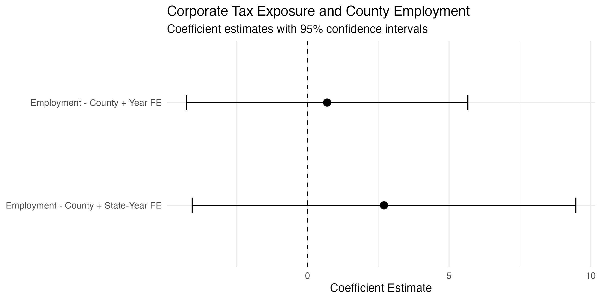
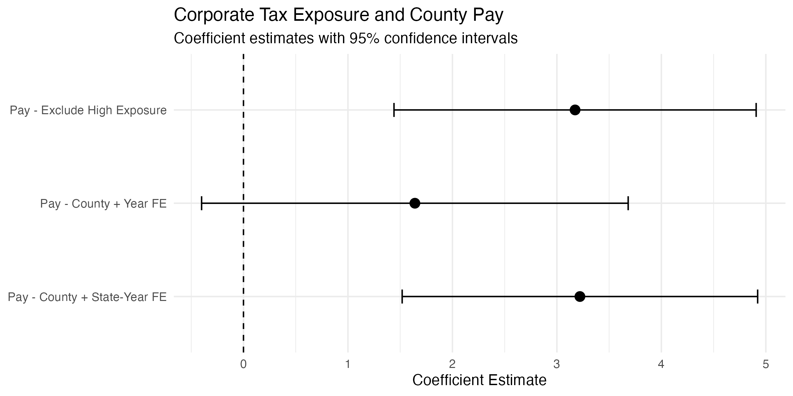

# State Corporate Taxes & Local Labor Markets

---


---

This project studies whether changes in state corporate income tax rates are associated with different labor market outcomes across U.S. counties. I focus on whether counties with greater initial manufacturing exposure respond differently to changes in their state's corporate tax rate.

The analysis combines historical state corporate tax rates with county-level employment and pay data from the BLS Quarterly Census of Employment and Wages (QCEW), covering 1990–2010.

## Research Question

Do changes in state corporate income tax rates have different relationships with employment and pay in counties that are more exposed to manufacturing?

I measure county exposure using the manufacturing share of private employment in 1990. Using a baseline measure keeps exposure fixed before later tax changes in the sample.

## Data

The final panel contains 54,700 county-year observations across 2,605 counties from 1990–2010.

Labor market outcomes come from the **BLS Quarterly Census of Employment and Wages (QCEW)**. I use annual county employment and average annual pay.

State corporate tax rates come from historical tax data included in the replication files for work by Juan Carlos Suárez Serrato and Owen Zidar.

Manufacturing exposure is calculated as:

\[
Manufacturing\ Exposure_c =
\frac{Manufacturing\ Employment_{c,1990}}
{Private\ Employment_{c,1990}}
\]

The average county in the analysis sample has a manufacturing employment share of about 26%.

## Empirical Approach

I interact each state's corporate tax rate with a county's 1990 manufacturing exposure:

\[
TaxRate_{st} \times ManufacturingExposure_c
\]

I first estimate models with county and year fixed effects. My preferred specification replaces year fixed effects with state-by-year fixed effects:

\[
Y_{ct}
=
\beta(TaxRate_{st} \times ManufacturingExposure_c)
+
\alpha_c
+
\gamma_{st}
+
\varepsilon_{ct}
\]

The outcomes are log employment and log average annual pay. Standard errors are clustered at the state level.

County fixed effects account for persistent differences across counties. State-by-year fixed effects absorb shocks shared by counties in the same state and year, so the interaction is identified from differences in initial manufacturing exposure across counties within the same state-year.

## Results

I do not find a statistically significant relationship between the tax-exposure interaction and county employment.

For average annual pay, the preferred specification produces a positive and statistically significant coefficient. The estimate is also similar after excluding counties where manufacturing accounted for more than 75% of private employment in 1990.

| Model | Coefficient | Standard Error |
|---|---:|---:|
| Employment — County + Year FE | 0.694 | 2.534 |
| Pay — County + Year FE | 1.641 | 1.042 |
| Employment — County + State-Year FE | 2.703 | 3.454 |
| Pay — County + State-Year FE | 3.220 | 0.868 |
| Pay — Excluding High-Exposure Counties | 3.174 | 0.884 |

The pay result is interesting, but I interpret it cautiously. The design shows how outcomes differ with predetermined manufacturing exposure within state-years; it does not by itself establish that corporate tax increases caused higher pay.

## Employment Results



The employment estimates are imprecise and their 95% confidence intervals include zero.

## Pay Results



The pay estimate is more precise in the state-by-year fixed-effects specification and remains similar when highly manufacturing-intensive counties are excluded.

## Descriptive Statistics

| Variable | Value |
|---|---:|
| County-year observations | 54,700 |
| Counties | 2,605 |
| Mean employment | 45,773 |
| Median employment | 10,566 |
| Mean annual pay | $25,878 |
| Median annual pay | $24,858 |
| Mean corporate tax rate | 6.48% |
| Mean manufacturing exposure | 26.3% |

## Limitations

The main limitation is that manufacturing employment is only a proxy for a county's exposure to the corporate sector. It does not directly measure which firms are subject to state corporate income taxes.

QCEW disclosure suppression also limits the counties for which I can construct manufacturing exposure in 1990.

Finally, tax changes can coincide with other economic and policy changes. State-by-year fixed effects absorb shocks common to counties within a state, but counties with different manufacturing exposure could still experience different underlying trends. I therefore treat the estimates as evidence of differential relationships rather than a definitive causal effect.

## Repository Structure

```text
code/
├── 01_build_tax_panel.R
├── 02_build_qcew_panel.R
├── 03_build_analysis_panel.R
└── 04_analysis.R

data/
├── raw/
└── processed/

output/
├── figures/
│   ├── employment_results.png
│   └── pay_results.png
└── tables/
    ├── descriptive_statistics.csv
    └── regression_results.csv
```

## Replication

Run the scripts in order:

1. `01_build_tax_panel.R` — cleans the state corporate tax data
2. `02_build_qcew_panel.R` — builds the county labor market panel and 1990 manufacturing exposure
3. `03_build_analysis_panel.R` — merges the datasets and creates the analysis variables
4. `04_analysis.R` — estimates the models and produces the tables and figures

The project is written in R using `tidyverse` for data construction and `fixest` for fixed-effects estimation.
